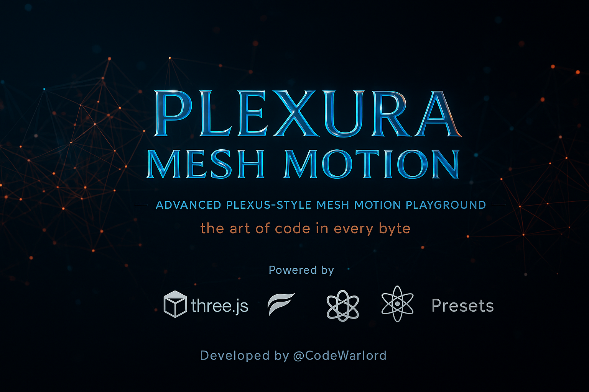
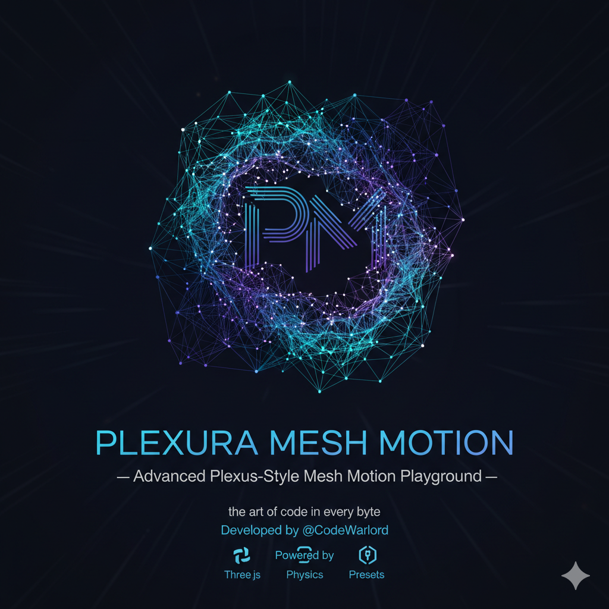

# Plexura Mesh Motion



An interactive 3D mesh visualization using Three.js and GSAP with physics simulation.

## Features

- Interactive particle system with dynamic connections
- Physics-based animations with customizable parameters
- Multiple creative presets
- Background customization (color, image, video)
- Export/import settings
- Responsive design
- **Internationalization (i18n)** - Supports 6 languages (EN, RU, DE, ES, IT, FR)

## Technologies Used

- [Three.js](https://threejs.org/) - 3D library
- [GSAP](https://greensock.com/gsap/) - Animation library
- Vanilla JavaScript

## Getting Started



Simply open `index.html` in a web browser to run the application.

## Usage

The interface provides controls for:
- Adjusting particle count and connection distances
- Modifying physics parameters (gravity, damping, etc.)
- Customizing visual appearance (colors, sizes)
- Setting background options
- Saving and loading configurations

## Internationalization (i18n)

The application supports 6 languages:
- English (default)
- Russian (Русский)
- German (Deutsch)
- Spanish (Español)
- Italian (Italiano)
- French (Français)

### Language Selection

A language selector is available in the top-right corner of the application. The language preference is saved in localStorage and also reflected in the URL parameter `?lang=xx` for easy sharing.

### Language Detection Order

1. URL parameter (`?lang=ru`)
2. localStorage preference
3. Browser language
4. Default to English

### Example URLs

```
https://username.github.io/plexura-mesh-motion/?lang=es
https://username.github.io/plexura-mesh-motion/?lang=de
```

### Adding New Languages

To add a new language:

1. Create a new JSON file in the `/i18n/` directory with the language code (e.g., `i18n/jp.json`)
2. Follow the same structure as existing language files
3. Add the language option to the language selector in `i18n/i18n.js`
4. Add the language code to the `supportedLanguages` array in `i18n/i18n.js`

### i18n Directory Structure

```
/i18n/
  en.json     # English translations (default)
  ru.json     # Russian translations
  de.json     # German translations
  es.json     # Spanish translations
  it.json     # Italian translations
  fr.json     # French translations
  i18n.js     # i18n loader and manager
```

### Translation Key Structure

All translation keys follow a hierarchical structure:
- `meta.title` - Page title
- `ui.controls` - Main controls heading
- `ui.presets.*` - Presets section
- `ui.general.*` - General settings
- `ui.motion.*` - Motion settings
- `ui.physics.*` - Physics settings
- `ui.appearance.*` - Appearance settings
- `ui.interact.*` - Interaction settings
- `ui.background.*` - Background settings
- `ui.io.*` - Import/Export settings
- `ui.actions.*` - Action buttons
- `hud.*` - HUD elements
- `badge` - Badge text

## License

This project is open source and available under the MIT License.